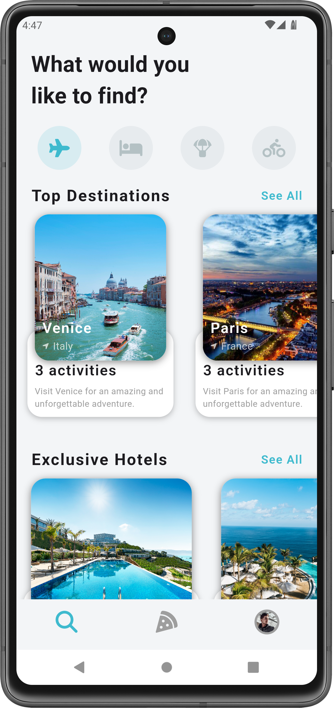

# Travel App UI in Flutter

This project is a Travel App UI built using Flutter. It features a visually appealing design with smooth transitions, parallax effects, and essential functionalities such as state management and persistent storage using shared preferences.

## Features

- **Modern UI**: A clean and attractive user interface designed for travel enthusiasts.
- **State Management**: Efficiently manages the state of the application using Flutter's built-in mechanisms.
- **Shared Preferences**: Stores user preferences locally using the `shared_preferences` package.
- **Shared Transition Animations**: Provides smooth transitions between screens with shared element animations.
- **Parallax Effect**: Adds depth to the UI with parallax scrolling effects.

## Packages Used

- [`font_awesome_flutter`](https://pub.dev/packages/font_awesome_flutter)
- [`shared_preferences`](https://pub.dev/packages/shared_preferences)

## Screenshots

| Home Screen                            | Detail Screen                           |
|----------------------------------------|-----------------------------------------|
|     |  |

## Shared Preferences

The `shared_preferences` package is used to store user preferences locally. This allows the app to remember user settings across sessions.

## Parallax Animation

The parallax effect is achieved using a custom `ParallaxFlowDelegate`. This creates a smooth and visually appealing animation for the UI components.

## Enjoy coding! 🎉
